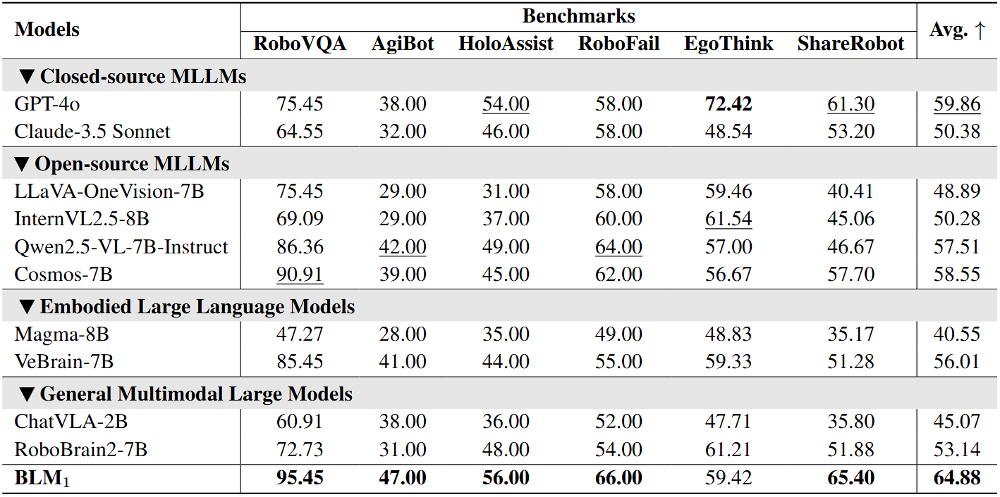
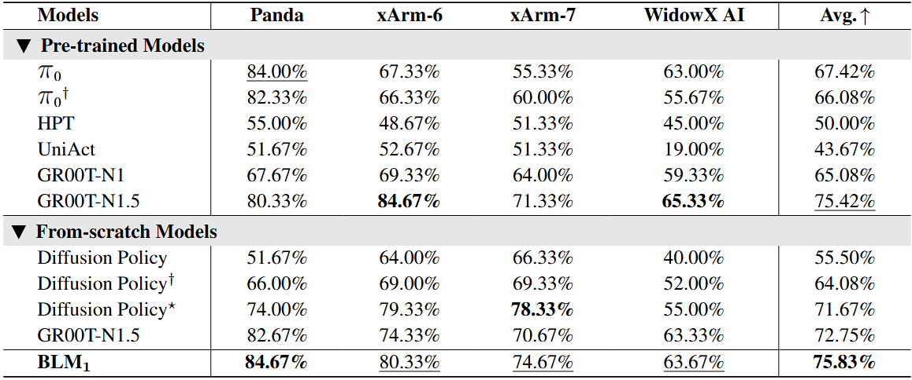

# BLM<sub>1</sub>: A Boundless Large Model for Cross-Space, Cross-Task, and Cross-Embodiment Learning


<p align="center">
        </a>&nbsp&nbsp⭐️ <a href="https://boundless-large-model.github.io">Project</a></a>&nbsp&nbsp  &nbsp&nbsp🤗 <a href="https://huggingface.co/BLM-Lab/BLM-Inference">Hugging Face</a>&nbsp&nbsp  &nbsp&nbsp📑 <a href="https://github.com/boundless-large-model/BLM-Inference/blob/main/Boundless_Large_Model.pdf">Paper</a>&nbsp&nbsp 
</p>


## 🔥 Overview
Multimodal large language models (MLLMs) have advanced vision–language reasoning and are increasingly deployed in embodied agents. However, significant limitations remain: MLLMs generalize poorly across digital–physical spaces and embodiments; vision–language–action models (VLAs) produce low-level actions yet lack robust high-level embodied reasoning; and most embodied large language models (ELLMs) are constrained to digital-space with poor generalization to physical world. Thus, unified models that operate seamlessly across digital and physical spaces while generalizing across embodiments and tasks remain absent. We introduce the <b>Boundless Large Model (BLM<sub>1</sub>)</b>, a multimodal spatial foundation model that preserves instruction following and reasoning, incorporates embodied knowledge, and supports robust cross-embodiment control. BLM<sub>1</sub> integrates three key capabilities—<i>cross-space transfer, cross-task learning, and cross-embodiment generalization</i>—via a two-stage training paradigm. Stage I injects embodied knowledge into the MLLM through curated digital corpora while maintaining language competence. Stage II trains a policy module through an intent-bridging interface that extracts high-level semantics from the MLLM to guide control, without fine-tuning the MLLM backbone. This process is supported by a self-collected cross-embodiment demonstration suite spanning four robot embodiments and six progressively challenging tasks. Evaluations across digital and physical benchmarks show that a single BLM<sub>1</sub> instance outperforms four model families—MLLMs, ELLMs, VLAs, and GMLMs—achieving <b>&sim;6%</b> gains in digital tasks and <b>&sim;3%</b> in physical tasks.


## 🚀 Features
- Achieve cross-space transfer, cross-task learning, and cross-embodiment generalization within a unified model.  
- Seamlessly migrate to cross-embodiment robot control while retaining native instruction-following capability.  
- A single model covers multiple embodiments, enabling cross-embodiment knowledge sharing and consistent control.  
- BLM-1 surpasses same-scale SOTA methods in comprehensive performance across spatial understanding, spatial reasoning, and spatial execution benchmarks.  


## 🛠️ Setup 

```bash
# build conda env.
conda create -n BLM python=3.10
conda activate BLM
pip install -r requirements.txt
```

## ⭐️ Inference


Install and launch VLLM
```bash
# Install vllm package
pip install vllm

# Launch BLM with vllm
vllm serve ./model  \
--port 8000 \
--trust-remote-code \
--dtype bfloat16 \
--max-model-len 128000 \
--served-model-name BLM
```

Run python script as example:
```python
from openai import OpenAI
import base64

openai_api_base = "http://127.0.0.1:8000/v1"
openai_api_key = "empty" 

client = OpenAI(
    api_key=openai_api_key,
    base_url=openai_api_base,
)

prompt = "What is in the picture?"
image = "./test.png"

with open(image, "rb") as f:
    encoded_image = base64.b64encode(f.read())
    encoded_image = encoded_image.decode("utf-8")
    base64_img = f"data:image;base64,{encoded_image}"

response = client.chat.completions.create(
    model="BLM",
    messages=[
        {
            "role": "system",
            "content": "You are a helpful assistant.",
        },
        {
            "role": "user",
            "content": [
                {"type": "image_url", "image_url": {"url": base64_img}},
                {"type": "text", "text": prompt},
            ],
        },
    ]
)

print(response.choices[0].message.content)
```


## 🤖 Evaluation

### Comparison with existing MLLMs and GMLMs on digital-space benchmarks
<div align="center">

</div>

### Comparison with existing VLAs on physical-space benchmarks

<div align="center">

</div>


**†** denotes the training of independent models on four robots, with each model evaluated across six tasks.
**★** denotes training independent models for each of the six tasks associated with four robots (24 models in total), with evaluation on the corresponding tasks for each robot.

## 📑 Citation
If you find this project useful, please consider citing our paper.
```bib
@article{
  BLM-1,
  title={BLM$_1$: A Boundless Large Model for Cross-Space, Cross-Task, and Cross-Embodiment Learning},
  author={WenTao Tan, Bowen Wang, Heng Zhi, Chenyu Liu, Zhe Li, Jian Liu, Zenrong Lin, Yukun Dai, Yipeng Chen, Wenjie Yang, Enci Xie, Hao Xue, Baixu Ji, Chen Xu, Zhibin Wang, Tianshi Wang, Lei Zhu, Heng Tao Shen},
  year={2025}
}
```
