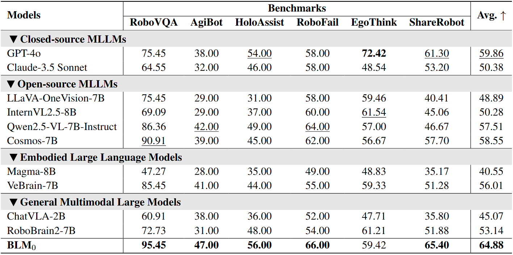
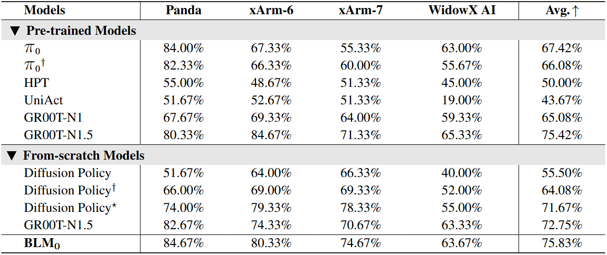

# BLM<sub>0</sub>: A Boundless Model for Cross-Space, Cross-Task, and Cross-Embodiment Learning


<p align="center">
        </a>&nbsp&nbsp⭐️ <a href="https://boundless-large-model.github.io">Project</a></a>&nbsp&nbsp  &nbsp&nbsp🤗 <a href="https://huggingface.co/BLM-Lab/BLM-Inference">Hugging Face</a>&nbsp&nbsp  &nbsp&nbsp📑 <a href="http://arxiv.org/">Paper</a>&nbsp&nbsp 
</p>


## 🔥 Overview
Multimodal large language models (MLLMs) have demonstrated strong vision-language reasoning and increasingly underpin embodied agents. However, unified models that simultaneously support tasks in digital and physical spaces and generalize across embodiments remain scarce. To address this gap, we propose <b>Boundless Large Model (BLM<sub>0</sub>)</b>, a multimodal spatial foundation model that preserves native instruction-following and reasoning while injecting embodied knowledge and enabling robust cross-embodiment control. BLM<sub>0</sub> unifies three core capabilities: cross-space transfer, cross-task learning, and cross-embodiment generalization, which are realized through a two-stage training recipe. Stage I uses curated digital corpora to impart embodied knowledge to the MLLM while preserving language abilities. Stage II trains a policy module via an intent-bridging interface that extracts high-level semantics from the MLLM to guide control, avoiding MLLM fine-tuning. It uses a self-collected cross-embodiment demonstration suite spanning four robot embodiments and six increasingly challenging tasks. We evaluate BLM<sub>0</sub> as a single model on both digital and physical benchmarks and compare it against four families: Multimodal Large Language Models, Embodied Large Language Models, Vision-Language-Action models, and General Multimodal Large Models. BLM<sub>0</sub> improves digital-space tasks by approximately <b>6%</b> and physical-space tasks by approximately <b>3%</b>.


## 🚀 Features
- Achieve cross-space transfer, cross-task learning, and cross-embodiment generalization within a unified model.  
- Seamlessly migrate to cross-embodiment robot control while retaining native instruction-following capability.  
- A single model covers multiple embodiments, enabling cross-embodiment knowledge sharing and consistent control.  
- BLM-0 surpasses same-scale SOTA methods in comprehensive performance across spatial understanding, spatial reasoning, and spatial execution benchmarks.  


## 🗞️ News
- **`2025-09-25`**: 🤗 [BLM-0 7B](https://huggingface.co/BLM-Lab/BLM-0) model checkpoint has been released in Huggingface.


## 🛠️ Setup 

```bash
# build conda env.
conda create -n BLM python=3.10
conda activate BLM
pip install -r requirements.txt
```

## ⭐️ Inference


Install and launch VLLM
```bash
# Install vllm package
pip install vllm

# Launch BLM with vllm
vllm serve ./model  \
--port 8000 \
--trust-remote-code \
--dtype bfloat16 \
--max-model-len 128000 \
--served-model-name BLM-0
```

Run python script as example:
```python
from openai import OpenAI
import base64

openai_api_base = "http://127.0.0.1:8000/v1"
openai_api_key = "empty" 

client = OpenAI(
    api_key=openai_api_key,
    base_url=openai_api_base,
)

prompt = "What is in the picture?"
image = "./test.png"

with open(image, "rb") as f:
    encoded_image = base64.b64encode(f.read())
    encoded_image = encoded_image.decode("utf-8")
    base64_img = f"data:image;base64,{encoded_image}"

response = client.chat.completions.create(
    model="BLM-0",
    messages=[
        {
            "role": "system",
            "content": "You are a helpful assistant.",
        },
        {
            "role": "user",
            "content": [
                {"type": "image_url", "image_url": {"url": base64_img}},
                {"type": "text", "text": prompt},
            ],
        },
    ]
)

print(response.choices[0].message.content)
```


## 🤖 Evaluation

### Comparison with existing MLLMs and GMLMs on digital-space benchmarks
<div align="center">

</div>

### Comparison with existing VLAs on physical-space benchmarks

<div align="center">

</div>


**†** denotes the training of independent models on four robots, with each model evaluated across six tasks.
**★** denotes training independent models for each of the six tasks associated with four robots (24 models in total), with evaluation on the corresponding tasks for each robot.

## 📑 Citation
If you find this project useful, please consider citing our paper.
```bib
@article{
  BLM-0,
  title={BLM$_0$: A Boundless Model for Cross-Space, Cross-Task, and Cross-Embodiment Learning},
  author={WenTao Tan, Bowen Wang, Heng Zhi, Chenyu Liu, Zhe Li, Jian Liu, Zenrong Lin, Yukun Dai, Yipeng Chen, Wenjie Yang, Enci Xie, Hao Xue, Baixu Ji, Chen Xu, Zhibin Wang, Tianshi Wang, Lei Zhu, Hengtao Shen},
  journal={},
  year={2025}
}
```
